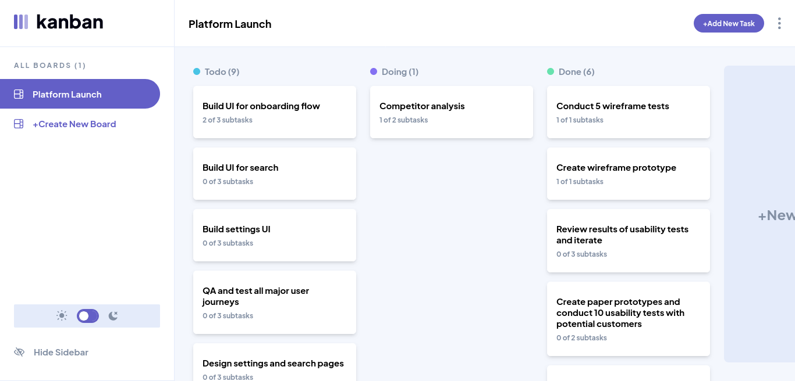

# Kanban API – Clean Architecture

> A full-stack task management app based on the [Frontend Mentor - Kanban task management app challenge](https://www.frontendmentor.io/challenges/kanban-task-management-web-app-wgQLt-HlbB), which originally focused on building a frontend only app. I decided to take it further by building a complete backend and architecting the project using Clean Architecture principles.
>  <!-- Replace with actual image path -->

## Links

You can view the live app and interact with both the frontend and the API:

- 🌐 Frontend: [https://kanban-client-chi.vercel.app](https://kanban-client-chi.vercel.app)
- 📘 API Docs (Swagger): [https://kanban-api-cleanarch.onrender.com/docs](https://kanban-api-cleanarch.onrender.com/docs)

## Architecture

The backend is structured around **Clean Architecture**, ensuring strong separation between concerns:

- The `core/` folder contains all pure domain logic: entities like `Task`, `Board`, and use cases like `createTask` or `getBoard`.
- `adapters/` bridges the domain to infrastructure, handling data persistence via Prisma which plays a central role in modeling and accessing relational data.
- `app/` exposes the API through Express, mapping domain results to HTTP responses.

## Implementation status

| Feature                        | Status          |
| ------------------------------ | --------------- |
| React Frontend                 | ✅ Live         |
| Express Backend                | ✅ Live         |
| Boards: create, read, delete   | ✅ Done         |
| Tasks: create, read, delete    | ✅ Done         |
| Subtasks: update               | ✅ Done         |
| Responsive: Main UI            | ✅ Done         |
| Optimistic UI updates          | 🚧 In progress  |
| Column changes (status)        | ✅ Done         |
| Boards: update                 | 🚧 In progress  |
| Tasks: update         | ⏳ Planned      |
| Responsive: Secondary overlays | ✅ Done         |
| Drag & drop                    | 💤 Not planned  |
| Dark mode                      | 💡 Nice to have |

## Testing strategy

Testing is done in three layers, matching the architecture:

- `core/`: use cases tested in isolation
- `adapters/`: repository integration via test DB
- `app/`: full request flow tested with `supertest`

## Notes

- This project intentionally overengineers a small app to explore clean architecture in a real, testable setup.
- The frontend code is not public, but the app is live and linked above.
- No auth implemented for now — everything is public for demo purposes.
